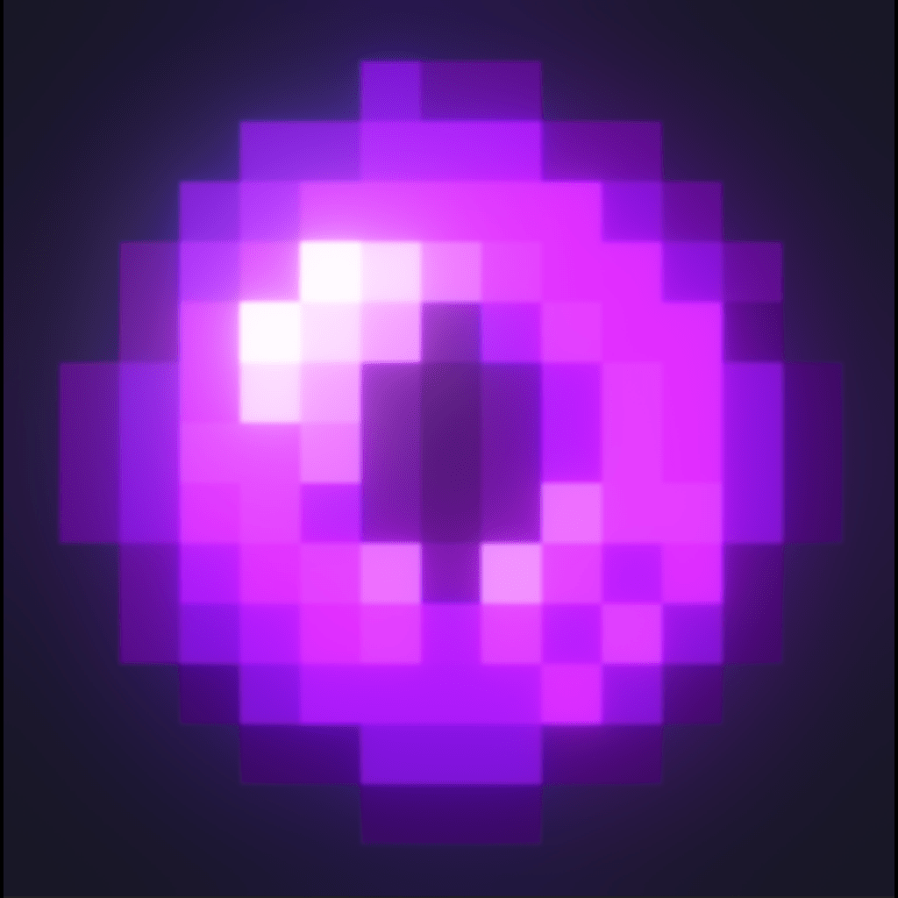

  
  <h1 style="position: absolute; top: 17%; right: 60%; transform: translate(50%, -50%); margin: 0; padding: 0; color: magenta; z-index: 1;">Colossal Cheat Menu V2</h1>
  <h2 style="position: absolute; top: 22%; right: 60%; transform: translate(50%, -50%); margin: 0; padding: 0; color: red; z-index: 1;">The Best Ghost Client.</h2>

  With a Unique UI written by lars, 
  it stands out from the competition with unique and NON SKIDDED features. 
  And did I mention its completely FREE and OPEN SOURCE!

# Features
- **CONFIGS**: CCMV2 is fully customizable! You can save your presets and share them with friends using the easy to use config system.
- **CLIENT SIDED GHOST CLIENT**: Wanna make videos while cheating? You can toggle all Client Sided visuals to fool your viewers!.
- **THIS GUY IS USING COLOSSAL**: You can see everyone else who is using CCMV2 in your lobby! They are displayed with a purple name and [CCM] prefix.
- **BYPASSES**: Multiple advanced bypasses to help you evade anti cheat.
- **NOTIFACATIONS**: Be notified when anti cheat gets flagged, when someone joins and leaves your room aswell as status changes on the menu.
- **ANTI CRASH**: Do you have problems with other users crashing you? Try our anti crash, laugh in their faces.
- **AMAZING VISUALS**: When using a mod that gives you a out of body experience a customizable ghost of yourself will be displayed.

### Movement
- **Excel Fly**
- **T Fly**
- **Wall Walk**
- **Speed** (7, 7.2, 7.4, 7.6, 7.8, 8, 8.2, 8.4, 8.6)
- **RGrip Speed** (7, 7.2, 7.4, 7.6, 7.8, 8, 8.2, 8.4, 8.6)
- **LGrip Speed** (7, 7.2, 7.4, 7.6, 7.8, 8, 8.2, 8.4, 8.6)
- **Platforms**
- **Upsidedown Monkey**
- **Watery Air**
- **Long Arms**
- **Spin Bot**
- **WASD Fly**
- **Floaty Monkey**

### Visual
- **Chams**
- **Box ESP**
- **Hollow Box ESP**
- **Sky Colour** (Purple, Red, Cyan, Green)
- **Why Is Everyone Looking At Me**
- **No Expressions**

### Player
- **No Finger**
- **Tag Gun**
- **Creeper Monkey**
- **Invis Monkey**
- **Tag Aura** (Really Close, Close, Legit, Semi Legit, Semi Blatant, Blatant, Rage)
- **Tag All**
- **Desync**

### Modders
- **Break NameTags**
- **Break ModCheckers**
- **PC Check Bypass**

### Computer
- **Disconnect**
- **Random Identity**
- **Join GTC**
- **Join TTT**
- **Join YTTV**
- **Modded Casual**
- **Modded Infection**

  <div

  Thank you for chosing Colossal Cheat Menu.
  Consider joining the discord. https://discord.gg/x4VEPyCEGR

